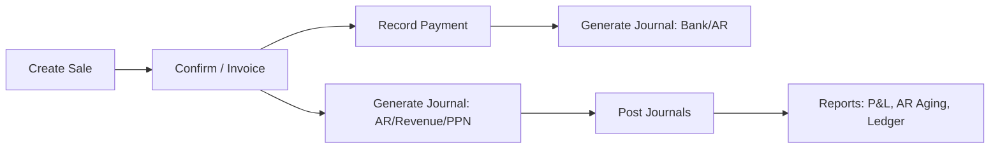
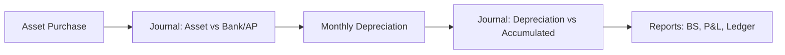

# Diagram Flow (Mermaid)

Berikut contoh diagram untuk membantu visualisasi alur. Anda dapat memperluas sesuai proses bisnis.

## Sales → Journal → Reports


## Purchase → Inventory → Journal
```mermaid
flowchart LR
  P1[Create Purchase] --> P2[Submit/Approve]
  P2 --> P3[Receipt (optional)]
  P3 --> P4[Generate Journal: Expense/Inventory + PPN]
  P4 --> P5[Payment: Cash/Transfer/Credit]
  P5 --> P6[Generate Journal: Bank/AP]
  P6 --> P7[Reports: AP Aging, Cash Flow, Ledger]
```

## Asset → Depreciation

